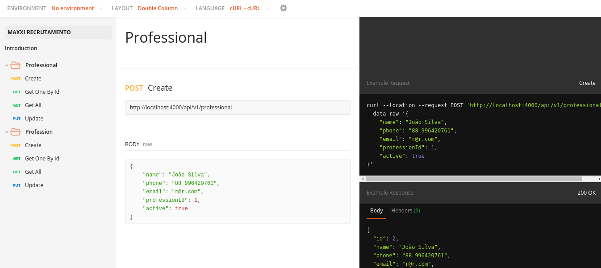
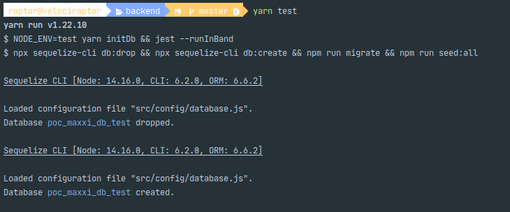
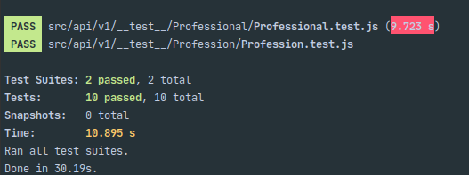

## Documentação do Backend

### Estrutura do Projeto

```text
| - src
| -- api
| --- utils
| --- v1
| ---- __test__
| ---- Entidade
| ------ EntidadeController
| ------ EntidadeRoute
| ------ EntidadeService
| ------ EntidadeValidation
| -- config
| -- database
| --- migrations
| --- seeders
| -- models
| -- app.js
| -- server.js
| -- routes.js
```

O diretório ``/api`` abrange os códigos relacionados a regra de negócio da aplicação dos quais:
 - ``/v1`` engloba os códigos da versão 1 do projeto;
 - ``/utils`` agrupa as funções que são reutilizadas na v1; 
Na pasta ``/v1`` as entidades são agrupadas de forma modular, no qual cada diretório de entidade contém todos os códigos relacionados à sua regra de negócio, além disso, o diretório ``__tests__`` contém os testes da v1 do projeto.
O diretório ``/config`` é responsável por agrupar os códigos de configuração do banco de dados, já em ``/database`` estão as migrations e seeders do projeto.
Em ``/model`` há a definição das entidades com os seus atributos e regras específicas.

A escolha da estrutura teve como objetivo separar as responsabilidades de cada parte do sistema. Essa definição foi feita com base em outros projetos já executados. Sempre que possível, estudo formas de melhorar essa estrutura.

### Principais Decisões

**Postgres**: recentemente estive engajado em alguns trabalhos independentes que usavam postgres como banco de dados.
Além disso, considerando os demais bancos sql, o postgres é o que tenho mais experiência. A escolha foi baseada na minha familiaridade com o banco de dados e na proposta de desenvolver
entidades com relacionamentos "fortes". Também tenho vasta experiência com MongoDb e poderia tê-lo utilizado no projeto, isso custaria-me algumas validações adicionais, considerando que
o Mongo permitiria adicionar um profissional com uma profissão que não existe no banco de dados, por exemplo.

**Sequelize**:  o sequelize foi o primeiro ORM NodeJs para bancos de dado SQL que tive a oportunidade de trabalhar. Eu o escolhi justamente por já tê-lo utilizado em outros projetos com o postgres.
Recentemente tive a oportunidade de conhecer o TypeORM, cujo propósito é semelhante ao do sequelize, porém, com utilização no TypeScript.

**Yup**: é um dos principais pacotes de validação de objetos no JavaScript, é bastante simples de utilizar e contém muitas funcionalidades interessantes. Além disso, pode ser reaproveitado no 
frontend ou em outras aplicações JS que usam, ou manipulam os mesmos conjuntos de dados. O yup ajuda a resolver alguns problemas do JS relacionados a composição dos objetos.

### Documentação da API

Utilizei o Postman para documentar a API. O Postman ilustra bem como os dados devem ser enviados, as variáveis necessárias, 
bem como exibe os exemplos de retorno da API. O problema é que a API fica pública, a menos que sejam adquiridos alguns dos planos deles.



[Encontre aqui  a Documentação da API](https://documenter.getpostman.com/view/2381170/TzRLkAkF)

### Configuração dos Testes

Para realização dos testes foram utilizadas duas bibliotecas: ``jest`` e ``supertest``. Os testes foram aplicados
aos arquivos de serviço e às rotas. Durante a realização do teste, um banco de dados de teste é criado.



Conjunto de testes sendo executados.



Trabalhar com testes é algo recente pra mim, acredito que essa estrutura pode ser melhorada para facilitar a realização dos testes e evitar que um determinado trecho 
de código afete os resultados dos demais testes.

### Configuração do Servidor

Disponibilizei o servidor na Web através de um Doplet da Digital Ocean com o Ubuntu de SO. O servidor web
foi configurado facilmente com Nginx e Pm2.

- [Base Url](http://167.99.48.158:4000/) - Não tem resposta configurada;
- [Lista de Profissões](http://167.99.48.158:4000/api/v1/profession);
- [Lista de Profissionais](http://167.99.48.158:4000/api/v1/professional);

### Como Executar Localmente
Requisitos:
- Postgres instalado e inicializado com usuário e senha padrão (postgres);
- criar um ``.env`` semelhante ao ``.env.example.js``

Passos para execução local:
- ``yarn`` - instalar dependências;
- ``yarn initDb`` - iniciar o banco de dados e rodar as migrations e seeders;
- ``yarn start`` - executar o projeto em produção;
- ``yarn dev`` - executar o projeto em desenvolvimento;
- ``yarn test`` - executar testes;

