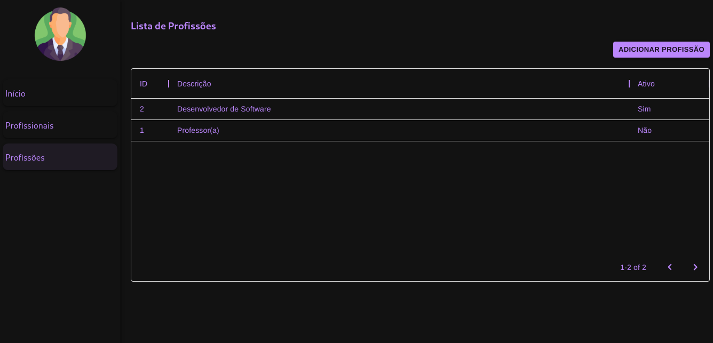
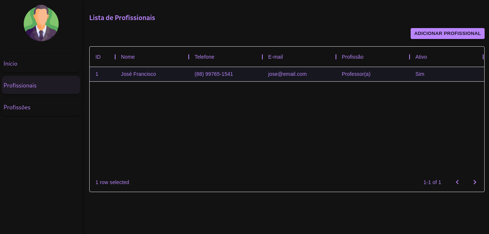
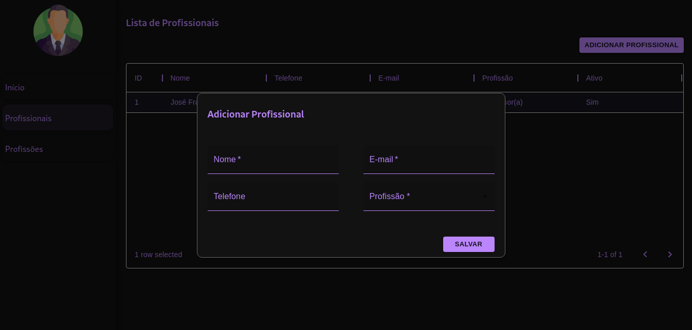
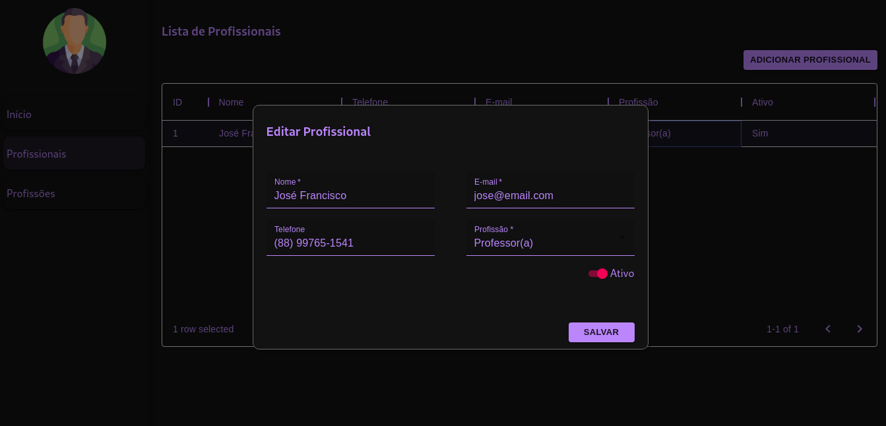
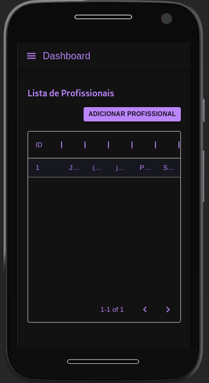
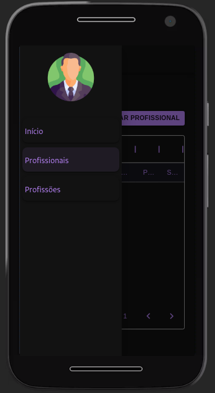

## Documentação do Frontend

### Estrutura do Projeto

```text
| - src
| -- api
| --- assets
| --- common
| ---- schemas
| -- components
| --- shared
| -- config
| -- hooks
| -- layouts
| -- pages
| -- routes
| -- App.js
| -- index.js
```
Descrição dos diretórios: 
- ``/api``  - contém os códigos de acesso à API via Axios;
- ``/assets`` - imagens e demais recursos do projeto;
- ``/common`` - contém código JavaScript compartilhado, tais como máscaras e os ``/schemas`` usados em validações;
- ``/components`` - agrega as 'partes' do projeto, arquivos que são utilizados para compor as páginas. Dentro de ``/shared`` estão so componentes que são largamente utilizados dentro da aplicação.  
- ``/config`` - responsável por armazenar arquivos de configuração, tais como as definições do axios e as variáveis de ambiente.
- ``/hooks`` - contém os códigos responsáveis pela manipulação da lógica da aplicação, fazendo uma 'ponte' entre as telas e os pontos de acesso à API.
Além disso, no React, os hooks diminuem a complexidade do código e contribuem com a manutenção a longo prazo. Os hooks também auxiliam na reutilização do código em outros projetos. Uma aplicação React Native
poderia utilizar os hooks do projeto sem necessidade de grandes alterações na estrutura.
- ``/layouts`` - agrupa os _layouts_ do projeto. Esses _layouts_ podem ser definições de _design_ de tela diferente para alguns tipos de acesso.
- ``/pages`` - contém os componentes que são renderizados como páginas. 

A escolha da estrutura teve como objetivo separar as responsabilidades de cada parte do sistema. Essa definição foi feita com base em outros projetos já executados. Sempre que possível, estudo formas de melhorar a estrutura.

### Principais Decisões

**Axios**: largamente utilizado em aplicações NodeJs para realização de requisições a APIs. É bastante completo e fácil de configurar. Tenho bastante experiência com ele.

**Material-UI**: o material-ui é uma framework React que utiliza os conceitos do Material Design na construção de telas.
O framework é bastante completo, contém vários tipos de componentes. Eu tenho pouca experiência no uso do material-ui e usei essa oportunidade para aprender mais sobre ele, bem como
aprender mais sobre o uso do "Dark Theme" (busquei seguir os conceitos do próprio Material Design, tais como as definições de cores e relevo, acredito que ainda há muito a melhorar nesse ponto).

**Formik**: O formik é muito poderoso na manipulação de formulários no React. Combinar o formik com o yup tornou a validação dos dados muito melhor. Além disso, foi fácil combinar o
formik com os componentes do Material-UI. Inclusive, há um pacote que combina os dois (formik-material-ui), eu não utilizei esse pacote, tentei experimentar aplicar o formik diretamente
nos componentes como uma forma de extrair mais aprendizado do processo..

**Yup**: é um dos principais pacotes de validação de objetos no JavaScript, é bastante simples de utilizar e contém muitas funcionalidades interessantes. Além disso, pode ser reaproveitado no 
frontend ou em outras aplicações JS que usam, ou manipulam os mesmos conjuntos de dados. O yup ajuda a resolver alguns problemas do JS relacionados a composição dos objetos. Os _schemas_ utilizados
no frontend foram reaproveitados do backend, com ajustes nas mensagens exibidas.

### Telas da Aplicação

Tela de Profissões


Tela de Profissionais


Tela de Adição de Profissionais


Tela de Edição de Profissionais


### Versão Responsiva
 
 O desenvolvimento considerou a visualização responsiva do projeto. Infelizmente o tipo de tabela que escolhi exige uma interveção
 via css para se ajustar, como não era prioridade, deixei para ajustar depois.
 
Menu e Tabela



Menu lateral ao clicar no botão.



### Configuração do Servidor

Disponibilizei o servidor na Web através de um Doplet da Digital Ocean com o Ubuntu de SO. O servidor web
foi configurado facilmente com Nginx e Pm2. Para execução do frontend, o Nginx precisa ser configurado para apontar
para ao diretório que contém o ``build`` do projeto.

- [Base Url](http://167.99.48.158/) - Acessa a página inicial do site

### Como Executar Localmente
Requisitos:
- Rodar o backend localmente ou utilizar o backend remoto;
- criar um ``.env`` semelhante ao ``.env.example.js``

Passos para execução local:
- ``yarn`` - instalar dependências;
- ``yarn start`` - executar o projeto em produção;
